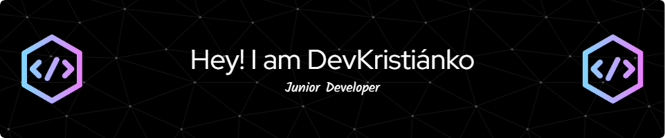

<!-- <h1 align="center">Hi 👋, I'm Kristián Červenka</h1> -->
<h3 align="center">A passionate Data Scientist from Slovakia</h3>

  

  

--- 

<!-- 
  

  
 -->

<!-- 
  
 --->

### 🌍 About Me:

📊 Aspiring Data Scientist with a strong passion for analytics, machine learning, and deep learning.

🧠 Experienced in building, training, and fine-tuning neural networks—from simple feedforward models to advanced CNNs, RNNs, and modern deep learning architectures.

💻 Actively sharpening my skills in Python, R, and SQL, working on real-world projects using TensorFlow and PyTorch.

📚 Lifelong learner currently pursuing a Software Engineering degree, constantly exploring new ways to push the boundaries of AI.

🤝 Open to collaborations, especially in areas like AI, finance, and NLP, where intelligent systems can create real impact.

🚀 Motivated by challenges and driven to transform data into meaningful insights and innovative solutions.

⚡ Fun fact **Young boy chasin' dreams ⭐**
---
<!--
- 🔭 I’m currently working on **Data Structures**

- 🌱 I’m currently learning **Framework,Data Science, Web Development,Ruby on Rails,AI**

- 👨‍💻 All of my projects are available at https://k1ko.github.io/portfolio.github.io/ [still work in progress...]

- 💬 Ask me about **React,Binary Trees,C,Python,JavaScript,Java,AI - Machine Learning**

- 📫 How to reach me **kristian.cervenka@gmail.com**

- ⚡ Fun fact **Young boy chasin' dreams ⭐** -->
### Connect with me

<!-- <h3 align="center">Connect with me:</h3>

 -->
<!--   
     
      -->
    
### Tech Stack
### Language and Tools

    
     
     
     
     
     
     
     
     
     

  

<h3 align="center">Languages and Tools:</h3>

                

 

<h3 align="center">Another Tools:</h3>

          

<h3 align="center">Support:</h3>

  

  

<!-- 

&nbsp;

 -->

 
  
  
  

